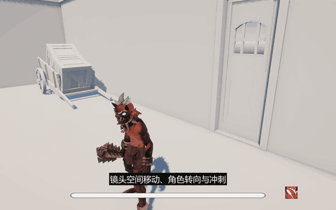
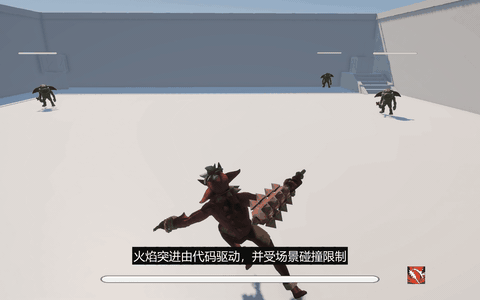
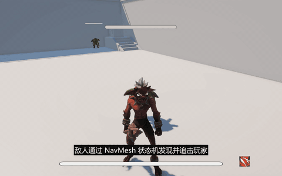
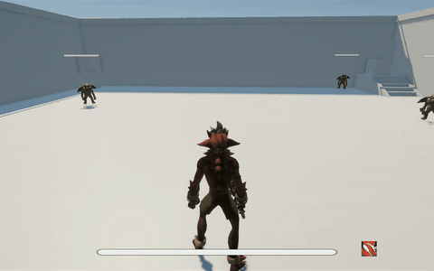
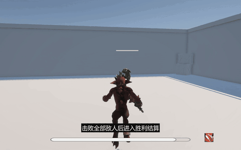
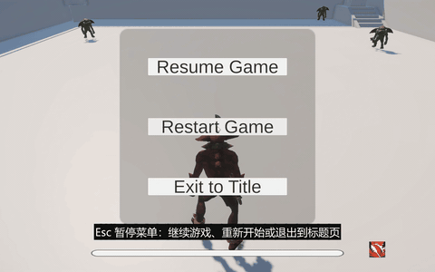
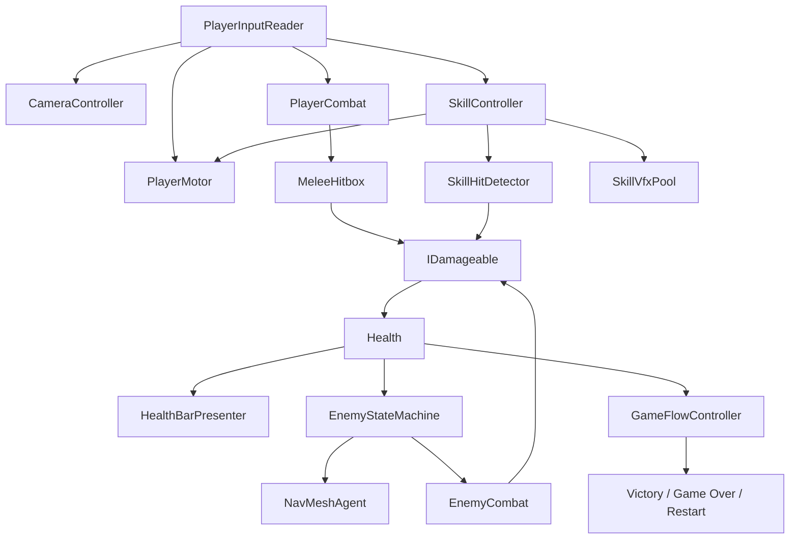

# Third Person Combat Demo

一个使用 Unity 6 制作的第三人称动作战斗 Vertical Slice。玩家可以在中世纪庭院中移动、冲刺、使用三段连击和火焰突进技能，与 3 个具有状态机和 NavMesh 寻路的敌人战斗，并完成胜利或失败后的完整游戏流程。

```text
主菜单 → 进入战斗 → 击败 3 个敌人 / Player 死亡 → 结算 → 重开或返回主菜单
```

## 功能演示

### 镜头空间移动与场景碰撞

角色移动方向由镜头水平朝向决定，并通过 `CharacterController` 统一处理移动、重力、楼梯和障碍碰撞。



### 三段普通攻击

三段连击支持输入缓存、固定衔接节点、收招阶段补输入和逐段攻击朝向修正；动画事件负责通知攻击窗口，伤害逻辑不直接写入动画状态。



### Enemy AI 与战斗反馈

Puglin 使用 `Idle / Chase / Attack / Hit / Dead` 状态机，通过 NavMesh 追击玩家。Player 与 Enemy 共用 `IDamageable + Health` 伤害与生命契约。



### 火焰突进技能

按 `E` 释放火焰突进。技能包含代码控制位移、障碍阻挡、多目标伤害、单次释放去重、冷却 UI，以及通过对象池复用的粒子和拖尾效果。



### 胜利、重开与完整流程

击败全部敌人后进入 Victory；Player 死亡时进入 Game Over。结算后可通过按钮重开或返回主菜单。



### 游戏内暂停菜单

按 `Esc` 暂停或恢复游戏。暂停菜单提供继续、重新开始和返回主菜单。



## 核心功能

- 第三人称镜头与镜头空间移动
- `CharacterController` 移动、重力、转向与冲刺
- 三段普通攻击、输入缓存、收招衔接和动画伤害窗口
- 基于 `IDamageable` 的通用伤害接口与事件驱动生命系统
- Puglin 的 Idle / Chase / Attack / Hit / Dead 状态机
- 基于 NavMesh 的追击、绕障和攻击距离判断
- 火焰突进技能、冷却 UI、命中去重和对象池 VFX
- Player 屏幕空间血条与 Enemy 世界空间血条
- 主菜单、Esc 暂停、Victory / Game Over 和按钮重开
- 约 22×22 米的中世纪庭院战斗场景

## 操作方式

| 操作 | 输入 |
|---|---|
| 移动 | `WASD` |
| 旋转镜头 | 鼠标移动 |
| 冲刺 | `Left Shift` |
| 普通攻击 / 三段连击 | 鼠标左键 |
| 火焰突进技能 | `E` |
| 暂停 / 恢复 | `Esc` |

## 技术栈

- Unity `6000.5.6f1`
- Universal Render Pipeline `17.5.0`
- Input System `1.20.0`
- Cinemachine `3.1.7`
- AI Navigation `2.0.14`
- Unity Test Framework `1.7.0`
- C# / Assembly Definition

## 架构概览



主要职责边界：

- `PlayerInputReader` 只读取并转换输入意图，不直接控制角色。
- `PlayerMotor` 是 Player 常规移动、转向和技能突进位移的唯一执行者。
- `PlayerCombat` 管理 Combo 状态；`MeleeHitbox` 负责目标检测和单次攻击去重。
- `Health` 不依赖 Player、Enemy、Animator 或 UI，通过事件通知表现层和流程层。
- `EnemyStateMachine` 负责状态迁移；`EnemyCombat` 负责攻击表现与命中结算。
- `CooldownPresenter`、`HealthBarPresenter` 只负责展示，不持有玩法规则。
- `GameFlowController` 只协调胜负、冻结和场景重载。

完整说明见 [PROJECT_ARCHITECTURE.md](Docs/PROJECT_ARCHITECTURE.md)。

## 测试与质量

当前稳定自动化测试共 19 条：

| 类型 | 结果 | 覆盖范围 |
|---|---:|---|
| EditMode | 14/14 PASS | Health、伤害边界、死亡事件、Reset、技能冷却 |
| PlayMode | 5/5 PASS | 斜向限速、冲刺恢复、技能再次释放、伤害去重、同帧死亡仲裁 |

此外完成了移动、镜头、碰撞、Combo、AI、多敌人拥挤、技能、菜单、暂停、胜负与重开的手工功能、边界和回归测试。最终检查结果：

- Console：`0 Error / 0 Warning`
- P0 / P1 缺陷：`0`
- 三轮完整游戏流程：PASS
- 3 个 Puglin 到 Player 的 NavMesh 路径：PASS
- 13 个场景 Prop 的简化碰撞：PASS

详细证据：

- [测试用例与执行结果](Docs/TEST_REPORT/)
- [Bug Reports](Docs/BUG_REPORTS.md)
- [当前项目状态](Docs/PROJECT_STATUS.md)

## 工程结构

```text
Assets/_Game/
├─ Animations/      # Player / Enemy 动画与 Animator
├─ Art/             # 角色、环境和 UI 资源
├─ Data/            # AttackDefinition / SkillDefinition 配置
├─ Prefabs/         # Player、Enemy、VFX
├─ Runtime/
│  ├─ Camera/
│  ├─ Combat/
│  ├─ Common/
│  ├─ Enemy/
│  ├─ GameFlow/
│  ├─ Input/
│  ├─ Player/
│  ├─ Skills/
│  └─ UI/
├─ Scenes/          # MainMenu / SampleScene
└─ Tests/           # EditMode / PlayMode

Docs/
├─ Images/          # README 功能演示 GIF
├─ ASSET_AUDIT.md
├─ BUG_REPORTS.md
├─ PROJECT_ARCHITECTURE.md
├─ PROJECT_STATUS.md
├─ ROADMAP.md
└─ TEST_REPORT/
```

## 运行项目

1. 安装 Unity Hub 和 Unity `6000.5.6f1`。
2. 克隆仓库：

   ```bash
   git clone https://github.com/sugakii/ThirdPersonCombatDemo.git
   ```

3. 按下方说明补齐未进入公开仓库的 Bestiary 原始资源。
4. 使用 Unity Hub 打开项目，等待 Package Manager 和资源导入完成。
5. 打开 `Assets/_Game/Scenes/MainMenu.unity`，进入 Play Mode。

Build Settings 中的场景顺序：

```text
0  Assets/_Game/Scenes/MainMenu.unity
1  Assets/_Game/Scenes/SampleScene.unity
```

## 第三方素材与复现

素材来自 [Quaternius](https://quaternius.com/)：

- [Bestiary - Dungeon Monsters Kit](https://quaternius.com/packs/bestiarydungeonmonsterskit.html)：Imp、Puglin，QAL v1.0
- [Medieval Village MegaKit](https://quaternius.com/packs/medievalvillagemegakit.html)：庭院环境与 Props，CC0 1.0
- [Universal Animation Library](https://quaternius.com/packs/universalanimationlibrary.html)：移动动画，CC0 1.0
- [Universal Animation Library 2](https://quaternius.com/packs/universalanimationlibrary2.html)：近战与技能动画，CC0 1.0

根据 Bestiary 的 QAL v1.0，原始 FBX/PNG 不在公开仓库中再分发。克隆后请从官方素材包取得下列文件，并保持文件名与路径不变：

```text
Assets/_Game/Art/Charactors/Player/Model/Imp.fbx
Assets/_Game/Art/Charactors/Player/Textures/T_Imp_BaseColor_1.png
Assets/_Game/Art/Charactors/Player/Textures/T_Imp_Normal.png
Assets/_Game/Art/Charactors/Player/Textures/T_Imp_Emissive.png
Assets/_Game/Art/Charactors/Player/Textures/T_Imp_ORM.png

Assets/_Game/Art/Charactors/Enemy/Puglin/Model/Puglin.fbx
Assets/_Game/Art/Charactors/Enemy/Puglin/Textures/T_Puglin_BaseColor_1.png
Assets/_Game/Art/Charactors/Enemy/Puglin/Textures/T_Puglin_Normal.png
Assets/_Game/Art/Charactors/Enemy/Puglin/Textures/T_Puglin_Emissive.png
Assets/_Game/Art/Charactors/Enemy/Puglin/Textures/T_Puglin_ORM.png
```

请保留仓库中已有的 `.meta` 文件，避免 Unity GUID 和 Prefab 引用变化。完整素材审计与许可说明见 [ASSET_AUDIT.md](Docs/ASSET_AUDIT.md)。

## 项目亮点

这是一个独立开发的求职展示项目，通过完整、可运行、可测试的战斗切片集中展示：

- Unity 第三人称玩法开发能力
- 模块职责与依赖方向意识
- 测试用例设计、缺陷记录和回归验证能力
- 从素材审计、开发、测试到 Build 的完整工作流程
